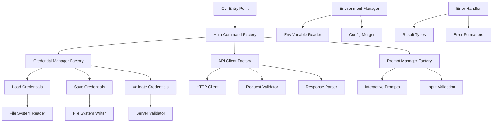

# CLI Authentication Implementation Plan - Functional & Factory Patterns

## Implementation Status

### Overview
This plan outlines the implementation of authentication functionality for the TypeScript CLI using strict functional programming patterns and factory functions. The implementation will port the existing Rust authentication logic while adhering to functional composition principles and avoiding classes entirely.

## Architecture Analysis

### Existing Rust Implementation Analysis

From analyzing the Rust code at `/apps/cli-deprecated/cli/src/commands/auth.rs` and related utilities, the key features are:

1. **Credential Management**: 
   - Stores credentials in `~/.buster/credentials` 
   - Supports YAML serialization
   - Environment variable overrides (BUSTER_HOST, BUSTER_API_KEY)

2. **CLI Arguments**:
   - `--host`, `--api-key`, `--no-save`, `--clear`, `--local`, `--cloud`
   - Environment variables: BUSTER_HOST, BUSTER_API_KEY
   - Interactive prompts for missing credentials

3. **Validation Flow**:
   - Loads cached credentials or defaults
   - Applies environment variable overrides
   - Prompts for missing credentials interactively
   - Validates credentials against server API
   - Saves credentials (unless --no-save flag)

4. **Host Configuration**:
   - Local: `http://localhost:3001`
   - Cloud: `https://api.buster.so` (default)
   - Custom via --host flag

## Functional Architecture Design

### Core Functional Principles

1. **Pure Functions**: All core logic implemented as pure functions with no side effects
2. **Factory Pattern**: Use factory functions to create configured instances
3. **Composition**: Build complex functionality by composing simple functions
4. **Immutability**: All data structures immutable by default
5. **Error Handling**: Use Result types or functional error handling patterns
6. **Dependency Injection**: Pass dependencies as function parameters
7. **Higher-Order Functions**: Use HOFs for middleware and configuration

### System Architecture Diagram



## Implementation Plan

### Phase 1: Core Functional Infrastructure

#### Ticket 1.1: Result Types and Error Handling (Functional)
**Location**: `/apps/cli/src/utils/result.ts`

```typescript
// Functional Result type implementation
export type Result<T, E = Error> = 
  | { success: true; data: T }
  | { success: false; error: E };

export const Ok = <T>(data: T): Result<T, never> => ({ success: true, data });
export const Err = <E>(error: E): Result<never, E> => ({ success: false, error });

// Functional combinators
export const map = <T, U, E>(
  fn: (value: T) => U
) => (result: Result<T, E>): Result<U, E> => 
  result.success ? Ok(fn(result.data)) : result;

export const flatMap = <T, U, E>(
  fn: (value: T) => Result<U, E>
) => (result: Result<T, E>): Result<U, E> => 
  result.success ? fn(result.data) : result;

export const mapError = <T, E, F>(
  fn: (error: E) => F
) => (result: Result<T, E>): Result<T, F> => 
  result.success ? result : Err(fn(result.error));

// Async Result utilities
export const asyncMap = <T, U, E>(
  fn: (value: T) => Promise<U>
) => async (result: Result<T, E>): Promise<Result<U, E>> => 
  result.success ? Ok(await fn(result.data)) : result;

export const asyncFlatMap = <T, U, E>(
  fn: (value: T) => Promise<Result<U, E>>
) => async (result: Result<T, E>): Promise<Result<U, E>> => 
  result.success ? await fn(result.data) : result;
```

#### Ticket 1.2: Functional Configuration Management
**Location**: `/apps/cli/src/utils/config-factory.ts`

```typescript
// Immutable configuration types
export interface BusterCredentials {
  readonly url: string;
  readonly apiKey: string;
}

export interface AuthConfig {
  readonly host?: string;
  readonly apiKey?: string;
  readonly noSave: boolean;
  readonly clear: boolean;
  readonly local: boolean;
  readonly cloud: boolean;
}

// Factory function for creating configuration
export const createAuthConfig = (args: Partial<AuthConfig>): AuthConfig => ({
  host: args.host,
  apiKey: args.apiKey,
  noSave: args.noSave ?? false,
  clear: args.clear ?? false,
  local: args.local ?? false,
  cloud: args.cloud ?? false,
});

// Pure functions for configuration resolution
export const resolveHost = (config: AuthConfig): string => {
  if (config.local) return 'http://localhost:3001';
  if (config.cloud) return 'https://api.buster.so';
  if (config.host) return config.host;
  return 'https://api.buster.so'; // default
};

export const mergeCredentials = (
  cached: Partial<BusterCredentials>,
  env: Partial<BusterCredentials>,
  args: Partial<BusterCredentials>
): BusterCredentials => ({
  url: args.url ?? env.url ?? cached.url ?? 'https://api.buster.so',
  apiKey: args.apiKey ?? env.apiKey ?? cached.apiKey ?? '',
});

// Configuration validation
export const validateAuthConfig = (config: AuthConfig): Result<AuthConfig, string> => {
  const conflictingFlags = [config.local, config.cloud, !!config.host].filter(Boolean);
  if (conflictingFlags.length > 1) {
    return Err('Cannot specify multiple host options (--local, --cloud, --host)');
  }
  return Ok(config);
};
```

#### Ticket 1.3: Functional File System Operations
**Location**: `/apps/cli/src/utils/fs-factory.ts`

```typescript
import { promises as fs } from 'node:fs';
import { homedir } from 'node:os';
import { join } from 'node:path';
import * as yaml from 'js-yaml';
import { z } from 'zod';

// Pure functions for path resolution
export const getBusterDirectory = (): string => join(homedir(), '.buster');
export const getCredentialsPath = (): string => join(getBusterDirectory(), 'credentials.yml');

// Factory for file system operations
export interface FileSystemOperations {
  readonly readCredentials: () => Promise<Result<BusterCredentials, string>>;
  readonly writeCredentials: (creds: BusterCredentials) => Promise<Result<void, string>>;
  readonly deleteCredentials: () => Promise<Result<void, string>>;
  readonly ensureDirectory: (path: string) => Promise<Result<void, string>>;
}

export const createFileSystemOperations = (): FileSystemOperations => ({
  readCredentials: async () => {
    try {
      const credentialsPath = getCredentialsPath();
      const content = await fs.readFile(credentialsPath, 'utf-8');
      const parsed = yaml.load(content) as unknown;
      
      const result = CredentialsSchema.safeParse(parsed);
      if (!result.success) {
        return Err(`Invalid credentials format: ${result.error.message}`);
      }
      
      return Ok(result.data);
    } catch (error) {
      return Err(`Failed to read credentials: ${error}`);
    }
  },

  writeCredentials: async (credentials) => {
    try {
      const busterDir = getBusterDirectory();
      const credentialsPath = getCredentialsPath();
      
      // Ensure directory exists
      await fs.mkdir(busterDir, { recursive: true });
      
      const yamlContent = yaml.dump(credentials);
      await fs.writeFile(credentialsPath, yamlContent, 'utf-8');
      
      return Ok(void 0);
    } catch (error) {
      return Err(`Failed to write credentials: ${error}`);
    }
  },

  deleteCredentials: async () => {
    try {
      const credentialsPath = getCredentialsPath();
      await fs.unlink(credentialsPath);
      return Ok(void 0);
    } catch (error) {
      if ((error as any).code === 'ENOENT') {
        return Ok(void 0); // File doesn't exist, that's fine
      }
      return Err(`Failed to delete credentials: ${error}`);
    }
  },

  ensureDirectory: async (path) => {
    try {
      await fs.mkdir(path, { recursive: true });
      return Ok(void 0);
    } catch (error) {
      return Err(`Failed to create directory: ${error}`);
    }
  },
});

// Zod schema for credentials
const CredentialsSchema = z.object({
  url: z.string(),
  apiKey: z.string(),
});
```

#### Ticket 1.4: Functional API Client with Factory Pattern
**Location**: `/apps/cli/src/utils/api-factory.ts`

```typescript
// API Client factory with functional composition
export interface ApiClientOperations {
  readonly validateApiKey: (host: string, apiKey: string) => Promise<Result<boolean, string>>;
  readonly makeRequest: <T>(
    endpoint: string,
    options: RequestOptions
  ) => Promise<Result<T, string>>;
}

interface RequestOptions {
  readonly method: 'GET' | 'POST' | 'PUT' | 'DELETE';
  readonly body?: unknown;
  readonly headers?: Record<string, string>;
}

// Higher-order function for creating authenticated requests
const withAuth = (apiKey: string) => (options: RequestOptions): RequestOptions => ({
  ...options,
  headers: {
    ...options.headers,
    'Authorization': `Bearer ${apiKey}`,
    'Content-Type': 'application/json',
    'User-Agent': 'buster-cli',
  },
});

// Functional HTTP client
const createHttpClient = () => ({
  request: async <T>(
    url: string,
    options: RequestOptions
  ): Promise<Result<T, string>> => {
    try {
      const response = await fetch(url, {
        method: options.method,
        headers: options.headers,
        body: options.body ? JSON.stringify(options.body) : undefined,
      });

      if (!response.ok) {
        const errorText = await response.text();
        return Err(`HTTP ${response.status}: ${errorText}`);
      }

      const data = await response.json() as T;
      return Ok(data);
    } catch (error) {
      return Err(`Request failed: ${error}`);
    }
  },
});

// Factory function for API client
export const createApiClient = (): ApiClientOperations => {
  const httpClient = createHttpClient();

  return {
    validateApiKey: async (host, apiKey) => {
      const endpoint = `${host}/api/v1/api_keys/validate`;
      const requestOptions = withAuth(apiKey)({
        method: 'POST',
        body: { api_key: apiKey },
      });

      const result = await httpClient.request<{ valid: boolean }>(endpoint, requestOptions);
      
      return map((response: { valid: boolean }) => response.valid)(result);
    },

    makeRequest: async <T>(endpoint: string, options: RequestOptions) => {
      return httpClient.request<T>(endpoint, options);
    },
  };
};
```

### Phase 2: Functional Authentication Logic

#### Ticket 2.1: Environment Variable Management (Functional)
**Location**: `/apps/cli/src/utils/env-factory.ts`

```typescript
// Pure function for reading environment variables
export interface EnvironmentVariables {
  readonly BUSTER_HOST?: string;
  readonly BUSTER_API_KEY?: string;
}

export const readEnvironmentVariables = (): EnvironmentVariables => ({
  BUSTER_HOST: process.env.BUSTER_HOST,
  BUSTER_API_KEY: process.env.BUSTER_API_KEY,
});

// Pure function for creating credentials from environment
export const credentialsFromEnvironment = (env: EnvironmentVariables): Partial<BusterCredentials> => ({
  url: env.BUSTER_HOST,
  apiKey: env.BUSTER_API_KEY,
});

// Environment manager factory
export interface EnvironmentManager {
  readonly getEnvironmentCredentials: () => Partial<BusterCredentials>;
  readonly hasRequiredVariables: () => boolean;
}

export const createEnvironmentManager = (): EnvironmentManager => {
  const env = readEnvironmentVariables();
  
  return {
    getEnvironmentCredentials: () => credentialsFromEnvironment(env),
    hasRequiredVariables: () => !!env.BUSTER_API_KEY,
  };
};
```

#### Ticket 2.2: Functional Input Prompting with Ink
**Location**: `/apps/cli/src/utils/prompt-factory.ts`

```typescript
import React from 'react';
import { render } from 'ink';
import TextInput from 'ink-text-input';
import { Box, Text } from 'ink';

// Functional prompt types
export interface PromptOperations {
  readonly promptForApiKey: (currentKey?: string) => Promise<Result<string, string>>;
  readonly promptForHost: (currentHost?: string) => Promise<Result<string, string>>;
  readonly promptForConfirmation: (message: string) => Promise<Result<boolean, string>>;
}

// Pure prompt configuration functions
export const createPromptConfig = (message: string, defaultValue?: string, isPassword = false) => ({
  message,
  defaultValue,
  isPassword,
});

// Functional Ink component for text input
const PromptComponent: React.FC<{
  message: string;
  defaultValue?: string;
  isPassword?: boolean;
  onSubmit: (value: string) => void;
}> = ({ message, defaultValue, isPassword, onSubmit }) => {
  const [value, setValue] = React.useState(defaultValue || '');

  return (
    <Box flexDirection="column">
      <Text>{message}</Text>
      <TextInput
        value={value}
        onChange={setValue}
        onSubmit={onSubmit}
        mask={isPassword ? '*' : undefined}
        placeholder={defaultValue}
      />
    </Box>
  );
};

// Factory for prompt operations
export const createPromptOperations = (): PromptOperations => ({
  promptForApiKey: (currentKey) => {
    return new Promise((resolve) => {
      const obfuscatedKey = currentKey 
        ? `${currentKey.slice(0, 4)}...` 
        : '[Not Set]';
      
      const message = `Enter your API key (current: ${obfuscatedKey}):`;
      
      const { unmount } = render(
        <PromptComponent
          message={message}
          defaultValue=""
          isPassword={false}
          onSubmit={(value) => {
            unmount();
            if (value.trim()) {
              resolve(Ok(value.trim()));
            } else if (currentKey) {
              resolve(Ok(currentKey)); // Keep existing key
            } else {
              resolve(Err('API key is required'));
            }
          }}
        />
      );
    });
  },

  promptForHost: (currentHost) => {
    return new Promise((resolve) => {
      const message = `Enter the URL of your Buster API (current: ${currentHost || 'https://api.buster.so'}):`;
      
      const { unmount } = render(
        <PromptComponent
          message={message}
          defaultValue={currentHost || 'https://api.buster.so'}
          onSubmit={(value) => {
            unmount();
            resolve(Ok(value.trim() || currentHost || 'https://api.buster.so'));
          }}
        />
      );
    });
  },

  promptForConfirmation: (message) => {
    return new Promise((resolve) => {
      const { unmount } = render(
        <PromptComponent
          message={`${message} (y/N):`}
          onSubmit={(value) => {
            unmount();
            const confirmed = value.toLowerCase().startsWith('y');
            resolve(Ok(confirmed));
          }}
        />
      );
    });
  },
});
```

#### Ticket 2.3: Functional Credential Management
**Location**: `/apps/cli/src/utils/credential-factory.ts`

```typescript
// Credential management with functional composition
export interface CredentialManager {
  readonly loadCredentials: () => Promise<Result<BusterCredentials, string>>;
  readonly saveCredentials: (credentials: BusterCredentials) => Promise<Result<void, string>>;
  readonly deleteCredentials: () => Promise<Result<void, string>>;
  readonly validateCredentials: (credentials: BusterCredentials) => Promise<Result<boolean, string>>;
  readonly resolveCredentials: (config: AuthConfig) => Promise<Result<BusterCredentials, string>>;
}

// Higher-order function for credential resolution pipeline
const createCredentialPipeline = (
  fsOps: FileSystemOperations,
  envManager: EnvironmentManager,
  promptOps: PromptOperations,
  apiClient: ApiClientOperations
) => {
  
  // Pure function for merging credential sources
  const mergeCredentialSources = (
    cached: Partial<BusterCredentials>,
    env: Partial<BusterCredentials>,
    args: Partial<BusterCredentials>
  ): Partial<BusterCredentials> => ({
    url: args.url || env.url || cached.url,
    apiKey: args.apiKey || env.apiKey || cached.apiKey,
  });

  // Pure function for checking if credentials are complete
  const areCredentialsComplete = (creds: Partial<BusterCredentials>): creds is BusterCredentials =>
    !!(creds.url && creds.apiKey);

  return {
    loadFromSources: async (config: AuthConfig): Promise<Result<Partial<BusterCredentials>, string>> => {
      const cachedResult = await fsOps.readCredentials();
      const cached = cachedResult.success ? cachedResult.data : {};
      
      const env = envManager.getEnvironmentCredentials();
      const args = {
        url: resolveHost(config),
        apiKey: config.apiKey,
      };

      const merged = mergeCredentialSources(cached, env, args);
      return Ok(merged);
    },

    promptForMissing: async (partial: Partial<BusterCredentials>): Promise<Result<BusterCredentials, string>> => {
      let credentials = { ...partial } as Partial<BusterCredentials>;

      // Prompt for host if missing
      if (!credentials.url) {
        const hostResult = await promptOps.promptForHost();
        if (!hostResult.success) return hostResult;
        credentials.url = hostResult.data;
      }

      // Prompt for API key if missing
      if (!credentials.apiKey) {
        const keyResult = await promptOps.promptForApiKey();
        if (!keyResult.success) return keyResult;
        credentials.apiKey = keyResult.data;
      }

      if (areCredentialsComplete(credentials)) {
        return Ok(credentials);
      }

      return Err('Failed to obtain complete credentials');
    },
  };
};

// Factory function for credential manager
export const createCredentialManager = (
  fsOps: FileSystemOperations,
  envManager: EnvironmentManager,
  promptOps: PromptOperations,
  apiClient: ApiClientOperations
): CredentialManager => {
  
  const pipeline = createCredentialPipeline(fsOps, envManager, promptOps, apiClient);

  return {
    loadCredentials: async () => {
      return fsOps.readCredentials();
    },

    saveCredentials: async (credentials) => {
      return fsOps.writeCredentials(credentials);
    },

    deleteCredentials: async () => {
      return fsOps.deleteCredentials();
    },

    validateCredentials: async (credentials) => {
      return apiClient.validateApiKey(credentials.url, credentials.apiKey);
    },

    resolveCredentials: async (config) => {
      // Load from all sources
      const partialResult = await pipeline.loadFromSources(config);
      if (!partialResult.success) return partialResult;

      const partial = partialResult.data;

      // Check if we need to prompt for confirmation to overwrite
      if (partial.apiKey && !config.apiKey) {
        const confirmResult = await promptOps.promptForConfirmation(
          'Existing credentials found. Do you want to overwrite them?'
        );
        if (!confirmResult.success) return Err('Failed to get confirmation');
        if (!confirmResult.data) return Err('Authentication cancelled');
      }

      // Prompt for any missing credentials
      const completeResult = await pipeline.promptForMissing(partial);
      if (!completeResult.success) return completeResult;

      return completeResult;
    },
  };
};
```

### Phase 3: Functional Auth Command Implementation

#### Ticket 3.1: Main Auth Command with Functional Composition
**Location**: `/apps/cli/src/commands/auth/index.ts`

```typescript
// Main auth command using functional composition
export interface AuthDependencies {
  readonly credentialManager: CredentialManager;
  readonly promptOperations: PromptOperations;
  readonly apiClient: ApiClientOperations;
}

// Pure function for auth command logic
const authCommandLogic = (deps: AuthDependencies) => async (config: AuthConfig): Promise<Result<void, string>> => {
  const { credentialManager, promptOperations, apiClient } = deps;

  // Handle --clear flag
  if (config.clear) {
    const deleteResult = await credentialManager.deleteCredentials();
    if (!deleteResult.success) return deleteResult;
    
    console.log('✅ Saved credentials cleared successfully.');
    return Ok(void 0);
  }

  // Resolve credentials from all sources
  const credentialsResult = await credentialManager.resolveCredentials(config);
  if (!credentialsResult.success) return credentialsResult;

  const credentials = credentialsResult.data;

  // Validate credentials
  const validationResult = await credentialManager.validateCredentials(credentials);
  if (!validationResult.success) return validationResult;

  if (!validationResult.data) {
    return Err('Invalid API key');
  }

  // Save credentials unless --no-save flag is set
  if (!config.noSave) {
    const saveResult = await credentialManager.saveCredentials(credentials);
    if (!saveResult.success) return saveResult;
  }

  console.log('✅ You\'ve successfully connected to Buster!');
  console.log(`   Host: ${credentials.url}`);
  console.log(`   API Key: ${'*'.repeat(Math.max(0, credentials.apiKey.length - 6))}${credentials.apiKey.slice(-6)}`);
  
  if (!config.noSave) {
    console.log('\n✅ Credentials saved successfully!');
  } else {
    console.log('\n⚠️  Note: Credentials were not saved due to --no-save flag');
  }

  return Ok(void 0);
};

// Factory function for creating auth command
export const createAuthCommand = () => {
  // Create all dependencies using factories
  const fsOps = createFileSystemOperations();
  const envManager = createEnvironmentManager();
  const promptOps = createPromptOperations();
  const apiClient = createApiClient();
  
  const credentialManager = createCredentialManager(fsOps, envManager, promptOps, apiClient);
  
  const dependencies: AuthDependencies = {
    credentialManager,
    promptOperations: promptOps,
    apiClient,
  };

  // Return the configured auth command function
  return authCommandLogic(dependencies);
};

// Command function that integrates with Commander
export const authCommand = async (options: AuthConfig): Promise<void> => {
  const authFn = createAuthCommand();
  const result = await authFn(options);
  
  if (!result.success) {
    console.error(`❌ Authentication failed: ${result.error}`);
    process.exit(1);
  }
};
```

#### Ticket 3.2: Functional Authentication Checker
**Location**: `/apps/cli/src/utils/auth-checker.ts`

```typescript
// Functional authentication checker for use by other commands
export interface AuthChecker {
  readonly checkAuthentication: () => Promise<Result<BusterCredentials, string>>;
  readonly requireAuthentication: () => Promise<BusterCredentials>;
}

// Pure function for auth checking logic
const createAuthCheckLogic = (
  fsOps: FileSystemOperations,
  envManager: EnvironmentManager,
  apiClient: ApiClientOperations
) => async (): Promise<Result<BusterCredentials, string>> => {
  
  // Try to load cached credentials
  const cachedResult = await fsOps.readCredentials();
  let credentials = cachedResult.success ? cachedResult.data : { url: '', apiKey: '' };

  // Override with environment variables
  const envCreds = envManager.getEnvironmentCredentials();
  credentials = {
    url: envCreds.url || credentials.url || 'https://api.buster.so',
    apiKey: envCreds.apiKey || credentials.apiKey,
  };

  // Check if we have an API key
  if (!credentials.apiKey) {
    return Err('Authentication required. Please run `buster auth` or set BUSTER_API_KEY.');
  }

  // Validate credentials
  const validationResult = await apiClient.validateApiKey(credentials.url, credentials.apiKey);
  if (!validationResult.success) {
    return Err(`Authentication failed: ${validationResult.error}. Please run \`buster auth\` to configure credentials.`);
  }

  if (!validationResult.data) {
    return Err('Invalid API key. Please run `buster auth` to configure credentials.');
  }

  return Ok(credentials);
};

// Factory for auth checker
export const createAuthChecker = (): AuthChecker => {
  const fsOps = createFileSystemOperations();
  const envManager = createEnvironmentManager();
  const apiClient = createApiClient();
  
  const checkLogic = createAuthCheckLogic(fsOps, envManager, apiClient);

  return {
    checkAuthentication: checkLogic,
    
    requireAuthentication: async () => {
      const result = await checkLogic();
      if (!result.success) {
        console.error(`❌ ${result.error}`);
        process.exit(1);
      }
      return result.data;
    },
  };
};
```

### Phase 4: Functional Testing Strategy

#### Ticket 4.1: Functional Unit Tests
**Location**: `/apps/cli/src/commands/auth/auth.test.ts`

```typescript
import { describe, it, expect, beforeEach, vi } from 'vitest';
import { Ok, Err } from '../../utils/result.js';
import { createAuthCommand } from './index.js';

describe('Auth Command - Functional Tests', () => {
  // Mock factories for testing
  const createMockDependencies = () => ({
    credentialManager: {
      loadCredentials: vi.fn(),
      saveCredentials: vi.fn(),
      deleteCredentials: vi.fn(),
      validateCredentials: vi.fn(),
      resolveCredentials: vi.fn(),
    },
    promptOperations: {
      promptForApiKey: vi.fn(),
      promptForHost: vi.fn(),
      promptForConfirmation: vi.fn(),
    },
    apiClient: {
      validateApiKey: vi.fn(),
      makeRequest: vi.fn(),
    },
  });

  it('should handle clear flag correctly', async () => {
    const mockDeps = createMockDependencies();
    mockDeps.credentialManager.deleteCredentials.mockResolvedValue(Ok(void 0));

    const authCommand = createAuthCommand();
    const result = await authCommand({ clear: true, noSave: false, local: false, cloud: false });

    expect(result.success).toBe(true);
    expect(mockDeps.credentialManager.deleteCredentials).toHaveBeenCalledOnce();
  });

  it('should validate credentials successfully', async () => {
    const mockDeps = createMockDependencies();
    const mockCredentials = { url: 'https://api.buster.so', apiKey: 'test-key' };
    
    mockDeps.credentialManager.resolveCredentials.mockResolvedValue(Ok(mockCredentials));
    mockDeps.credentialManager.validateCredentials.mockResolvedValue(Ok(true));
    mockDeps.credentialManager.saveCredentials.mockResolvedValue(Ok(void 0));

    const authCommand = createAuthCommand();
    const result = await authCommand({ noSave: false, clear: false, local: false, cloud: false });

    expect(result.success).toBe(true);
    expect(mockDeps.credentialManager.validateCredentials).toHaveBeenCalledWith(mockCredentials);
    expect(mockDeps.credentialManager.saveCredentials).toHaveBeenCalledWith(mockCredentials);
  });

  it('should handle validation failures', async () => {
    const mockDeps = createMockDependencies();
    const mockCredentials = { url: 'https://api.buster.so', apiKey: 'invalid-key' };
    
    mockDeps.credentialManager.resolveCredentials.mockResolvedValue(Ok(mockCredentials));
    mockDeps.credentialManager.validateCredentials.mockResolvedValue(Ok(false));

    const authCommand = createAuthCommand();
    const result = await authCommand({ noSave: false, clear: false, local: false, cloud: false });

    expect(result.success).toBe(false);
    expect(result.error).toBe('Invalid API key');
  });
});

// Pure function tests
describe('Configuration Functions', () => {
  it('should resolve host correctly', () => {
    expect(resolveHost({ local: true, cloud: false, host: undefined })).toBe('http://localhost:3001');
    expect(resolveHost({ local: false, cloud: true, host: undefined })).toBe('https://api.buster.so');
    expect(resolveHost({ local: false, cloud: false, host: 'https://custom.host' })).toBe('https://custom.host');
    expect(resolveHost({ local: false, cloud: false, host: undefined })).toBe('https://api.buster.so');
  });

  it('should merge credentials correctly', () => {
    const cached = { url: 'cached-url', apiKey: 'cached-key' };
    const env = { url: 'env-url' };
    const args = { apiKey: 'args-key' };

    const result = mergeCredentials(cached, env, args);
    expect(result).toEqual({
      url: 'env-url',      // env overrides cached
      apiKey: 'args-key',  // args overrides everything
    });
  });
});
```

#### Ticket 4.2: Integration Tests
**Location**: `/apps/cli/src/commands/auth/auth.int.test.ts`

```typescript
import { describe, it, expect, beforeEach, afterEach } from 'vitest';
import { promises as fs } from 'node:fs';
import { join } from 'node:path';
import { tmpdir } from 'node:os';
import { createAuthCommand } from './index.js';

describe('Auth Command - Integration Tests', () => {
  let tempDir: string;
  let originalHome: string | undefined;

  beforeEach(async () => {
    // Create temporary directory for testing
    tempDir = await fs.mkdtemp(join(tmpdir(), 'buster-auth-test-'));
    originalHome = process.env.HOME;
    process.env.HOME = tempDir;
  });

  afterEach(async () => {
    // Cleanup
    await fs.rm(tempDir, { recursive: true, force: true });
    if (originalHome) {
      process.env.HOME = originalHome;
    } else {
      delete process.env.HOME;
    }
  });

  it('should create credentials file', async () => {
    const authCommand = createAuthCommand();
    
    // Mock the API validation to succeed
    vi.mock('../../utils/api-factory.js', () => ({
      createApiClient: () => ({
        validateApiKey: vi.fn().mockResolvedValue({ success: true, data: true }),
      }),
    }));

    const config = {
      apiKey: 'test-api-key',
      host: 'https://test.buster.so',
      noSave: false,
      clear: false,
      local: false,
      cloud: false,
    };

    const result = await authCommand(config);
    expect(result.success).toBe(true);

    // Check that credentials file was created
    const credentialsPath = join(tempDir, '.buster', 'credentials.yml');
    const exists = await fs.access(credentialsPath).then(() => true).catch(() => false);
    expect(exists).toBe(true);
  });

  it('should read environment variables correctly', async () => {
    process.env.BUSTER_API_KEY = 'env-api-key';
    process.env.BUSTER_HOST = 'https://env.buster.so';

    const authCommand = createAuthCommand();
    
    // The command should use environment variables
    const config = { noSave: true, clear: false, local: false, cloud: false };
    const result = await authCommand(config);

    expect(result.success).toBe(true);
    // Verify that environment variables were used
  });
});
```

## Implementation Benefits

### Functional Programming Benefits

1. **Testability**: Pure functions are easy to test in isolation
2. **Composability**: Functions can be combined to create complex behavior
3. **Predictability**: No side effects make code predictable and debuggable
4. **Reusability**: Pure functions can be reused across different contexts
5. **Error Handling**: Functional error handling with Result types is explicit and safe

### Factory Pattern Benefits

1. **Dependency Injection**: Dependencies are passed as function parameters
2. **Configuration**: Factory functions can be configured with different parameters
3. **Testing**: Easy to create mock implementations for testing
4. **Flexibility**: Different implementations can be swapped by changing the factory
5. **No Classes**: Avoids the complexity of class-based OOP

### Architecture Benefits

1. **Clear Separation**: Each factory handles a specific concern
2. **Immutability**: All data structures are immutable by default
3. **Type Safety**: Full TypeScript type safety throughout
4. **Error Handling**: Consistent error handling with Result types
5. **Modularity**: Each component can be developed and tested independently

## Integration with Existing CLI

### Command Registration
```typescript
// In main.ts
import { Command } from 'commander';
import { authCommand } from './commands/auth/index.js';

const program = new Command();

program
  .command('auth')
  .description('Authenticate with Buster API')
  .option('--host <url>', 'Buster API host URL')
  .option('--api-key <key>', 'Your Buster API key')
  .option('--no-save', 'Don\'t save credentials to disk')
  .option('--clear', 'Clear saved credentials')
  .option('--local', 'Use local buster instance')
  .option('--cloud', 'Use cloud buster instance')
  .action(authCommand);
```

### Usage by Other Commands
```typescript
// In other commands
import { createAuthChecker } from '../../utils/auth-checker.js';

export const deployCommand = async () => {
  const authChecker = createAuthChecker();
  const credentials = await authChecker.requireAuthentication();
  
  // Use credentials for API calls
  console.log(`Deploying to ${credentials.url}...`);
};
```

## Security Considerations

1. **Credential Storage**: Credentials are stored in YAML format (matching Rust implementation)
2. **File Permissions**: Ensure ~/.buster directory has appropriate permissions
3. **Memory Management**: Clear sensitive data from memory when possible
4. **Input Validation**: All inputs are validated using Zod schemas
5. **Error Messages**: Avoid leaking sensitive information in error messages

## Success Criteria

1. **Functional Parity**: All Rust auth functionality replicated
2. **No Classes**: Entire implementation uses functions and factories
3. **Type Safety**: Full TypeScript type safety with Zod validation
4. **Testability**: Comprehensive unit and integration tests
5. **Error Handling**: Robust error handling with Result types
6. **User Experience**: Rich Ink UI for interactive prompts
7. **Security**: Secure credential storage and handling
8. **Performance**: Fast startup and execution times

This implementation plan provides a complete functional architecture for authentication while strictly adhering to functional programming principles and factory patterns. The design is modular, testable, and maintains compatibility with the existing Rust implementation.