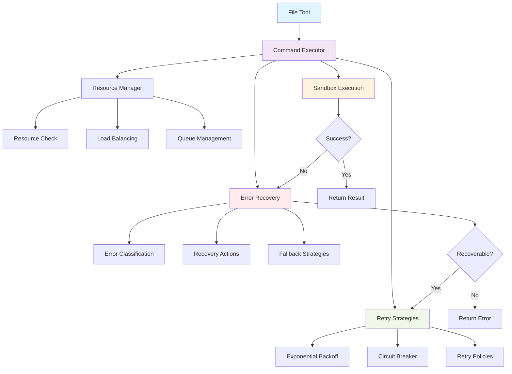

# Graceful Error Recovery for File Tools

## Overview

Implement comprehensive error recovery utilities to handle resource exhaustion and transient errors in the sandbox environment. The goal is to make AI agents resilient to exit code 127 (command not found), resource limits, and process creation failures in a 1GB/1CPU sandbox with parallel agent execution.

## Problem Analysis

**Current Issues:**
- Multiple agents run in parallel, exhausting system resources
- Exit code 127 errors occur even when commands are installed
- Resource limits prevent shell/process creation
- Current tools throw errors and terminate agent execution
- No retry mechanisms for recoverable errors

**Target Files:**
- `bash-execute-tool.ts` - Bash command execution
- `grep-search-tool.ts` - File content searching  
- `read-files-tool.ts` - File content reading
- Need new shared utilities in `@packages/ai/src/agents/shared/`

## Affected Components

### Packages
- `@buster/ai` - Core AI agents and tools
- `@buster/sandbox` - Sandboxed execution environment

### Files to Modify
1. `packages/ai/src/tools/file-tools/bash-tool/bash-execute-tool.ts`
2. `packages/ai/src/tools/file-tools/grep-search-tool/grep-search-tool.ts`
3. `packages/ai/src/tools/file-tools/read-files-tool/read-files-tool.ts`

### Files to Create
1. `packages/ai/src/agents/shared/error-recovery.ts` - Core error recovery utilities
2. `packages/ai/src/agents/shared/resource-manager.ts` - Resource-aware execution
3. `packages/ai/src/agents/shared/retry-strategies.ts` - Configurable retry patterns
4. `packages/ai/src/agents/shared/command-executor.ts` - Resilient command wrapper
5. `packages/ai/src/agents/shared/index.ts` - Barrel exports

## System Design



## Implementation Tickets

### Ticket 1: Core Error Recovery Infrastructure
**Priority**: High  
**Dependencies**: None  
**Affected**: `packages/ai/src/agents/shared/`

**Tasks:**
- Create `error-recovery.ts` with error classification system
- Implement recoverable vs non-recoverable error detection
- Add error code mapping (127, 126, resource exhaustion patterns)
- Create recovery action framework
- Unit tests for error classification

**Acceptance Criteria:**
- Can classify exit codes 127, 126 as recoverable
- Detects resource exhaustion patterns in stderr
- Provides structured error information
- 95%+ test coverage

**Key Implementation Details:**
- Error classification based on exit codes and stderr patterns
- Recovery action strategies (wait, retry, fallback)
- Structured error reporting with recovery suggestions

### Ticket 2: Retry Strategies and Backoff
**Priority**: High  
**Dependencies**: Ticket 1  
**Affected**: `packages/ai/src/agents/shared/`

**Tasks:**
- Create `retry-strategies.ts` with configurable retry policies
- Implement exponential backoff with jitter
- Add circuit breaker pattern for failing resources
- Create retry budget system to prevent infinite loops
- Add retry strategy selection based on error type

**Acceptance Criteria:**
- Exponential backoff: 100ms, 200ms, 400ms, 800ms, 1600ms
- Circuit breaker opens after 5 consecutive failures
- Maximum 5 retries per operation
- Jitter prevents thundering herd
- 90%+ test coverage

**Key Implementation Details:**
- Configurable retry policies per error type
- Resource-aware retry delays
- Circuit breaker state management

### Ticket 3: Resource-Aware Command Execution
**Priority**: High  
**Dependencies**: Ticket 1, 2  
**Affected**: `packages/ai/src/agents/shared/`

**Tasks:**
- Create `resource-manager.ts` for resource monitoring
- Implement command queue with concurrency limits
- Add resource health checks before execution
- Create load balancing for parallel operations
- Implement graceful degradation strategies

**Acceptance Criteria:**
- Limits concurrent operations based on system load
- Queues commands when resources are constrained
- Health checks prevent execution on overloaded system
- Graceful degradation with reduced functionality
- 85%+ test coverage

**Key Implementation Details:**
- Semaphore-based concurrency control
- Resource health metrics (CPU, memory)
- Command prioritization and queuing

### Ticket 4: Resilient Command Executor Wrapper
**Priority**: High  
**Dependencies**: Ticket 1, 2, 3  
**Affected**: `packages/ai/src/agents/shared/`

**Tasks:**
- Create `command-executor.ts` as unified execution interface
- Integrate error recovery, retry, and resource management
- Add command timeout handling with resource awareness
- Implement fallback execution strategies
- Create comprehensive logging and monitoring

**Acceptance Criteria:**
- Single interface for all command execution
- Automatic error recovery and retry
- Resource-aware timeout adjustment
- Fallback to simplified execution modes
- Detailed execution metrics and logging

**Key Implementation Details:**
- Wrapper around sandbox execution
- Integrated error handling pipeline
- Fallback execution modes

### Ticket 5: Update Bash Execute Tool
**Priority**: Medium  
**Dependencies**: Ticket 4  
**Affected**: `packages/ai/src/tools/file-tools/bash-tool/bash-execute-tool.ts`

**Tasks:**
- Replace direct sandbox calls with resilient command executor
- Add resource-aware command batching
- Implement graceful degradation for command failures
- Update error responses to include recovery suggestions
- Add comprehensive integration tests

**Acceptance Criteria:**
- Uses new command executor for all operations
- Handles exit code 127 gracefully without agent termination
- Provides actionable error messages
- Maintains backward compatibility
- Integration tests cover resource exhaustion scenarios

**Key Implementation Details:**
- Gradual replacement of sandbox calls
- Enhanced error messaging
- Resource-aware batching

### Ticket 6: Update Grep Search Tool
**Priority**: Medium  
**Dependencies**: Ticket 4  
**Affected**: `packages/ai/src/tools/file-tools/grep-search-tool/grep-search-tool.ts`

**Tasks:**
- Integrate resilient command executor
- Add fallback search strategies for ripgrep failures
- Implement partial result handling
- Update error handling to be non-terminal
- Add performance monitoring

**Acceptance Criteria:**
- Graceful handling of ripgrep command failures
- Fallback to basic search when resources constrained
- Partial results when search times out
- Non-blocking error responses
- Performance metrics collection

**Key Implementation Details:**
- Fallback search implementations
- Partial result aggregation
- Resource-aware search optimization

### Ticket 7: Update Read Files Tool
**Priority**: Medium  
**Dependencies**: Ticket 4  
**Affected**: `packages/ai/src/tools/file-tools/read-files-tool/read-files-tool.ts`

**Tasks:**
- Integrate resilient command executor for sandbox operations
- Add file batching with resource awareness
- Implement partial file reading on resource constraints
- Update error handling for individual file failures
- Add file size and resource usage monitoring

**Acceptance Criteria:**
- Batch file operations based on available resources
- Graceful handling of individual file read failures
- Partial content delivery when resources constrained
- Individual file errors don't affect batch operation
- Resource usage tracking per file operation

**Key Implementation Details:**
- Smart file batching algorithms
- Individual file error isolation
- Resource usage estimation

### Ticket 8: Integration Testing and Validation
**Priority**: Medium  
**Dependencies**: Ticket 5, 6, 7  
**Affected**: Multiple test files

**Tasks:**
- Create comprehensive integration tests simulating resource exhaustion
- Test agent resilience under high load conditions
- Validate error recovery in multi-agent scenarios
- Performance testing with concurrent operations
- Create load testing scenarios

**Acceptance Criteria:**
- Agents continue operation under resource constraints
- Error recovery works in multi-agent scenarios
- Performance degradation is graceful
- No agent termination from recoverable errors
- Load testing passes with 10+ concurrent agents

**Key Implementation Details:**
- Resource exhaustion simulation
- Multi-agent test scenarios
- Performance benchmarking

## Testing Strategy

### Unit Tests
- **Error Recovery**: Test error classification, recovery actions
- **Retry Strategies**: Test backoff algorithms, circuit breaker
- **Resource Manager**: Test concurrency limits, queuing
- **Command Executor**: Test integrated execution pipeline

### Integration Tests
- **Resource Exhaustion**: Simulate low resource conditions
- **Multi-Agent**: Test with parallel agent execution
- **Tool Integration**: Test updated file tools under stress
- **Sandbox Integration**: Test with actual sandbox environment

### Test Assertions
```typescript
describe('Error Recovery', () => {
  it('should classify exit code 127 as recoverable', () => {
    const error = { exitCode: 127, stderr: 'command not found' };
    expect(classifyError(error)).toEqual({
      type: 'command_not_found',
      recoverable: true,
      strategy: 'retry_with_backoff'
    });
  });

  it('should handle resource exhaustion gracefully', () => {
    const error = { exitCode: 1, stderr: 'cannot fork: Resource temporarily unavailable' };
    expect(classifyError(error)).toEqual({
      type: 'resource_exhaustion',
      recoverable: true,
      strategy: 'wait_and_retry'
    });
  });
});

describe('Command Executor', () => {
  it('should retry failed commands with backoff', async () => {
    const executor = new CommandExecutor({ maxRetries: 3 });
    const result = await executor.execute('failing-command');
    expect(result.retryCount).toBeLessThanOrEqual(3);
  });

  it('should queue commands when resources are limited', async () => {
    const executor = new CommandExecutor({ maxConcurrency: 2 });
    const promises = Array(5).fill(0).map(() => executor.execute('test-command'));
    const results = await Promise.all(promises);
    expect(results.every(r => r.success || r.recoverable)).toBe(true);
  });
});
```

## Potential Challenges

### Technical Hurdles
1. **Resource Detection**: Accurately detecting resource exhaustion in sandbox
2. **Retry Logic**: Balancing aggressiveness with system stability
3. **Concurrency Control**: Managing parallel operations without deadlocks
4. **Error Classification**: Distinguishing recoverable from fatal errors

### Implementation Considerations
1. **Backward Compatibility**: Ensure existing agent behavior is preserved
2. **Performance Impact**: Minimize overhead from error recovery mechanisms
3. **Configuration**: Allow tuning of retry and resource parameters
4. **Monitoring**: Provide visibility into error recovery operations

### Risk Mitigation
1. **Gradual Rollout**: Feature flags for error recovery behavior
2. **Fallback Modes**: Always provide degraded functionality
3. **Circuit Breakers**: Prevent cascade failures
4. **Comprehensive Logging**: Enable debugging of complex error scenarios

## Configuration

### Environment Variables
```typescript
// Resource management
AGENT_MAX_CONCURRENT_OPERATIONS=3
AGENT_COMMAND_TIMEOUT_MS=30000
AGENT_RESOURCE_CHECK_INTERVAL_MS=5000

// Retry configuration
AGENT_MAX_RETRIES=5
AGENT_INITIAL_BACKOFF_MS=100
AGENT_MAX_BACKOFF_MS=5000
AGENT_BACKOFF_MULTIPLIER=2

// Circuit breaker
AGENT_CIRCUIT_BREAKER_THRESHOLD=5
AGENT_CIRCUIT_BREAKER_TIMEOUT_MS=60000
```

### Runtime Configuration
```typescript
interface ErrorRecoveryConfig {
  maxRetries: number;
  initialBackoffMs: number;
  maxBackoffMs: number;
  backoffMultiplier: number;
  maxConcurrentOperations: number;
  commandTimeoutMs: number;
  circuitBreakerThreshold: number;
}
```

## Success Metrics

### Resilience Metrics
- **Agent Uptime**: >99% under normal load, >95% under high load
- **Error Recovery Rate**: >90% of recoverable errors should be recovered
- **Command Success Rate**: >95% eventual success for valid commands
- **Response Time**: <2x degradation under resource constraints

### Performance Metrics
- **Retry Overhead**: <10% additional latency for successful operations
- **Resource Utilization**: Maintain <80% CPU/memory usage
- **Concurrent Operations**: Support 10+ parallel agents
- **Queue Wait Time**: <5 seconds average for queued operations

## Monitoring and Observability

### Metrics to Track
- Error classification accuracy
- Retry success rates by error type
- Resource utilization patterns
- Command execution times
- Queue depths and wait times
- Circuit breaker state changes

### Logging Strategy
- Structured JSON logs for all error recovery actions
- Retry attempt tracking with backoff timings
- Resource constraint detection events
- Command execution metrics
- Agent performance degradation alerts

---

## Status: Planning Complete
**Next Phase**: Begin implementation with Ticket 1 (Core Error Recovery Infrastructure)
**Timeline**: 2-3 days for core infrastructure, 1-2 days per tool update
**Risk Level**: Medium - requires careful testing in sandbox environment